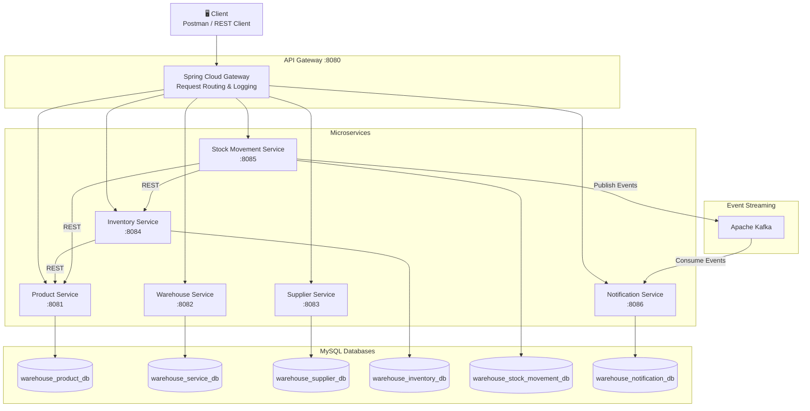

# High-Level Architecture

## System Architecture Diagram

## Architecture Principles

1. **Single Responsibility**: Each microservice owns one business domain
2. **Database per Service**: Each service has its own database schema — no shared databases
3. **API Gateway**: Single entry point for all client requests
4. **Event-Driven**: Kafka for asynchronous notifications (stock events, low-stock alerts)
5. **Synchronous REST**: Inter-service calls use REST when immediate response is needed
6. **Circuit Breaker**: Resilience4j protects against cascading failures
