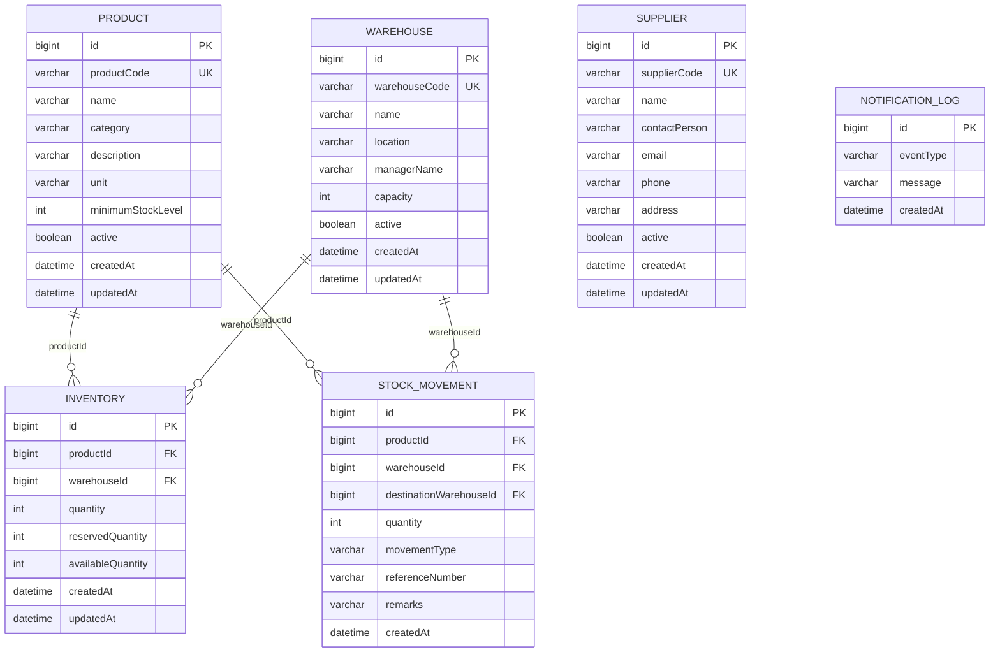

# Database Design

## Database per Service Architecture

Each microservice has its own MySQL database. Services communicate via REST APIs, **never** by directly accessing another service's database. This ensures loose coupling and allows each service to evolve its schema independently.

## Why No Direct JPA Relationships?

In a microservices architecture, entities like `Product` and `Warehouse` are owned by different services with different databases. Using JPA `@ManyToOne` relationships between them would:

1. **Violate service boundaries** — it would require shared database access
2. **Create tight coupling** — changes to one service's schema would break other services
3. **Prevent independent deployment** — services couldn't be deployed independently

Instead, we use **ID references** (`productId`, `warehouseId`) and resolve them via REST calls when needed.

## Database Mapping

| Service | Database | Primary Entity |
|---------|----------|---------------|
| Product Service | `warehouse_product_db` | `products` |
| Warehouse Service | `warehouse_service_db` | `warehouses` |
| Supplier Service | `warehouse_supplier_db` | `suppliers` |
| Inventory Service | `warehouse_inventory_db` | `inventory` |
| Stock Movement Service | `warehouse_stock_movement_db` | `stock_movements` |
| Notification Service | `warehouse_notification_db` | `notification_logs` |
