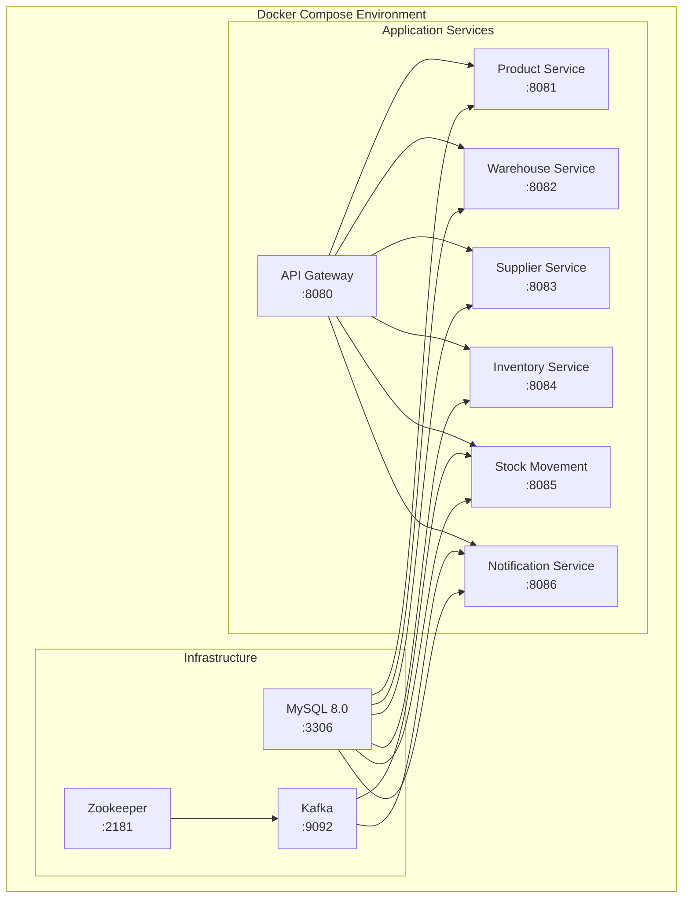

# Deployment Architecture

## Docker Deployment Diagram



## Starting the System

### Using Docker Compose

```bash
# Build and start all services
docker-compose up --build

# Start in background
docker-compose up --build -d

# View logs
docker-compose logs -f

# Stop all services
docker-compose down

# Stop and remove volumes
docker-compose down -v
```

### Running Locally (without Docker)

**Prerequisites:**
- Java 11
- Maven 3.6+
- MySQL 8.0 running on localhost:3306
- Kafka running on localhost:9092

```bash
# 1. Create databases
mysql -u root -p < docker/mysql-init/init.sql

# 2. Build all services
mvn clean install -DskipTests

# 3. Start each service (in separate terminals)
cd product-service && mvn spring-boot:run
cd warehouse-service && mvn spring-boot:run
cd supplier-service && mvn spring-boot:run
cd inventory-service && mvn spring-boot:run
cd stock-movement-service && mvn spring-boot:run
cd notification-service && mvn spring-boot:run
cd api-gateway && mvn spring-boot:run
```

## Port Mapping

| Service | Port |
|---------|------|
| API Gateway | 8080 |
| Product Service | 8081 |
| Warehouse Service | 8082 |
| Supplier Service | 8083 |
| Inventory Service | 8084 |
| Stock Movement Service | 8085 |
| Notification Service | 8086 |
| MySQL | 3306 |
| Kafka | 9092 |
| Zookeeper | 2181 |
