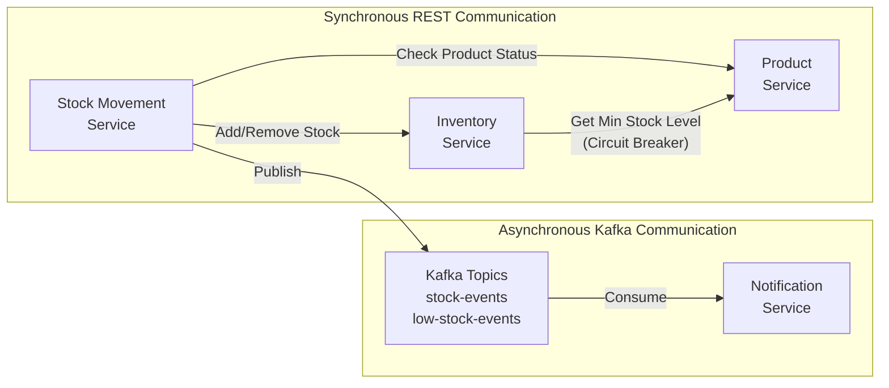
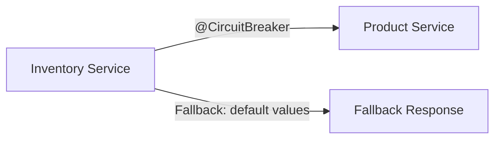

# Service Communication

## Communication Patterns

## Why Synchronous REST?

- **Stock Movement → Inventory**: When stock moves IN or OUT, inventory quantities must be updated **immediately** and the result confirmed before recording the movement.
- **Inventory → Product**: The low-stock check needs the product's `minimumStockLevel`, which is owned by Product Service.

## Why Asynchronous Kafka?

- **Notifications**: Sending alerts is a "fire and forget" operation. If the Notification Service is temporarily down, messages wait in Kafka and are processed when it recovers.
- **Decoupling**: The Stock Movement Service doesn't need to know about or wait for notification delivery.

## Circuit Breaker

When Product Service is unavailable, the circuit breaker activates and returns a default `ProductDTO` with `minimumStockLevel=0`, allowing the Inventory Service to continue operating gracefully.
