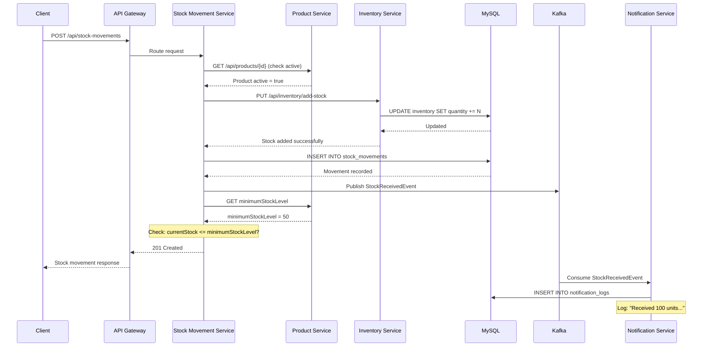

# Stock IN Sequence Diagram

## Flow: Receiving Stock into Warehouse



## Example Request

```json
POST /api/stock-movements
{
    "productId": 1,
    "warehouseId": 1,
    "quantity": 100,
    "movementType": "IN",
    "referenceNumber": "PO-2024-001",
    "remarks": "Received from supplier SUP-001"
}
```
