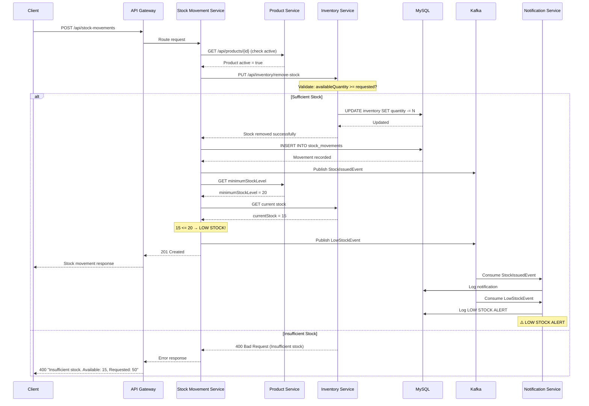

# Stock OUT Sequence Diagram

## Flow: Issuing Stock from Warehouse



## Example: Insufficient Stock

```json
POST /api/stock-movements
{
    "productId": 1,
    "warehouseId": 1,
    "quantity": 50,
    "movementType": "OUT",
    "referenceNumber": "MFG-2024-001",
    "remarks": "Issued to manufacturing line"
}

// Response (400 Bad Request):
{
    "success": false,
    "message": "Insufficient stock. Available: 15, Requested: 50"
}
```
